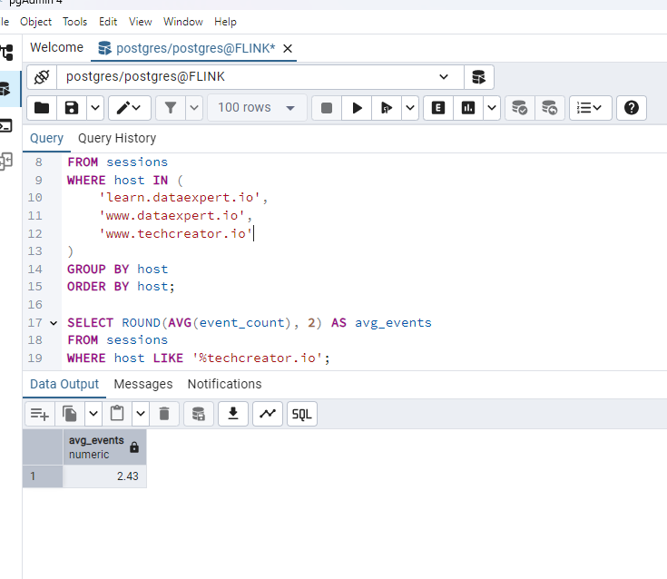
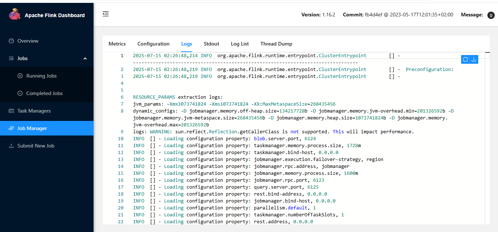

# Web Sessionization with Apache Flink & PostgreSQL

## 📘 Overview

This project demonstrates how to **sessionize web traffic events** using **Apache Flink** and store the output in **PostgreSQL**. The sessionization is based on a 5-minute inactivity gap for each combination of `IP address` and `host`.

---

## 🛠️ Technologies Used

- **Apache Flink** (v1.16.2)
- **PostgreSQL** with **pgAdmin 4**
- **Python (PyFlink)** for batch job
- **Docker** for container orchestration

---

## 🎯 Objectives

- **Sessionize web events** using Flink’s session window functionality (5-minute gap).
- **Store sessionized data** into a PostgreSQL table.
- **Analyze results** to:
  1. Determine the **average number of events per session** on `techcreator.io` subdomains.
  2. Compare session patterns across key hosts.

---

## ✅ Features Implemented

- ⏱️ **Session Windows** with Flink: 
  Using SQL-like syntax in PyFlink to detect user sessions by `IP` and `host`.

- 🗃️ **Data Sink to PostgreSQL**:
  Flink job inserts processed session data into the `sessions` table in PostgreSQL.

- 📊 **SQL Analysis** via pgAdmin:
  Aggregate and comparative insights were generated from sessionized data.

---

## 🔍 Results

### ✅ Hosts Compared
- `learn.dataexpert.io`
- `www.dataexpert.io`
- `www.techcreator.io`

### 📊 Average Events per Session on Tech Creator

```sql
SELECT ROUND(AVG(event_count), 2) AS avg_events
FROM sessions
WHERE host LIKE '%techcreator.io';
-- Output: 2.43
```

### 📊 Host-Level Session Comparison

```sql
SELECT host, COUNT(*) AS total_sessions, ROUND(AVG(event_count), 2) AS avg_events_per_session
FROM sessions
WHERE host IN (
  'learn.dataexpert.io',
  'www.dataexpert.io',
  'www.techcreator.io'
)
GROUP BY host
ORDER BY host;
```

---

## 📸 Screenshots

| Session Table Output | SQL Result (Tech Creator) | Flink Dashboard |
|----------------------|---------------------------|------------------|
|  |  |  |

---

## 📝 How to Reproduce

1. **Start your Flink and PostgreSQL containers** via Docker Compose.
2. **Run your PyFlink job** to sessionize the data.
3. **Connect to pgAdmin** and run the SQL queries above to generate insights.

---

## 📂 File Structure

```
project-root/
├── sessionize_web_events.py         # PyFlink job
├── docker-compose.yml               # For Flink + PostgreSQL setup
├── README.md                        # This file
├── Screenshot 2025-07-15 202943.png
├── average_tech_creator.png
└── apache_flink_dashboard.png
```

---

## 🚀 Future Improvements

- Add **unit tests** for PyFlink transformations.
- Automate pipeline with **Airflow or Dagster**.
- Stream events in **real-time** from a message broker (e.g., Kafka).

---

## 👏 Acknowledgments

Thanks to the [DataExpert Bootcamp] and Flink community for helpful documentation and resources.
